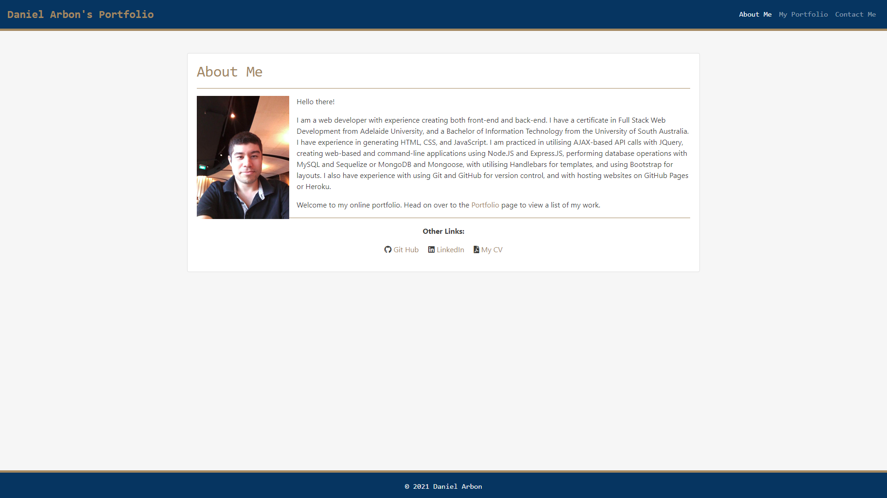

# 20: React Porfolio

## Description:
This project is an adaptation of a previous project (Responsive Portfolio). In that project, a 3-page personal professional portfolio was created using HTML and CSS, with Bootstrap for appearance. This task for this project was to recreate that website using React, with page serving via React Router. Mostly it is a fairly straightforward conversion of static page content into React Component. The individual projects on the portfolio page are imported from a file of object arrays.

## Link
The live version of the website is deployed on Git Hub pages. Check the link the in the repo sidebar, or click [here](https://arbdt.github.io/react-portfolio/) to visit.

## Preview
